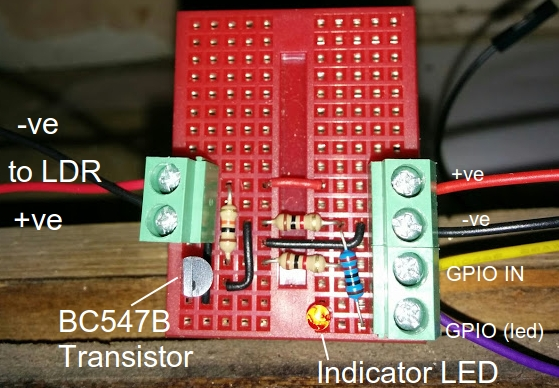
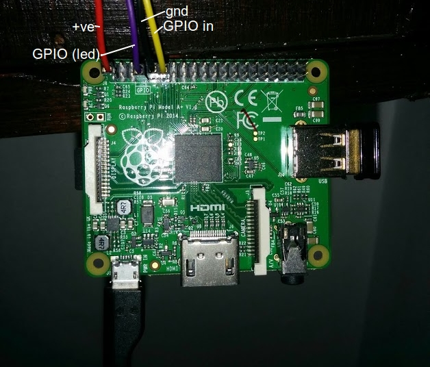

# raspi-elec

This repository contains code for setting up a raspberry pi pulse counter for reading led pulses from an electricity meter.

Since 2.0.0 this software is provided as a docker container intended to be run on a raspberry pi.

Installing Docker on the Raspberry Pi is very simple, simply run:

## Requirements

* A raspberry pi with an up to date version of raspbian
* Docker (install with `curl -sSL https://get.docker.com | sh`)

## Building the docker container

The following environment variables must be set in an env file and passed at runtime with `--env-file` (an example is incldue din the repo).

|Variable|Definition|
|---|---|
|MQTT|Enable publishing to MQTT using following info|
|MQTT_HOST|MQTT broker hostname|
|MQTT_PORT|MQTT broker port|
|MQTT_USERNAME|MQTT account username|
|MQTT_PASSWORD|MQTT account password|
|MQTT_TOPIC|MQTT topic on which to publish|
|MQTT_QOS|MQTT quality of service level|
|ELEC_INTERVAL|Interval over which electricity measurements are taken|
|ELEC_LOG|File path for pulse data log file|
|ECONOMY7|Does the electricity meter use economy seven or split metering? {0,1}|
|DAY_START|What time does the day rate start? (HH:MM)|
|NIGHT_START|Does the does the night rate start? (HH:MM)|
|DAY_RATE|What is the cost of a unit during the day?|
|NIGHT_RATE|What is the cost of a unit during the night?|
|PULSE_RATE|What does one led pulse signify in units of kWh?|
|DURATION|Duration of a small sleep after recording an LED pulse (should be a small number, e.g. - 0.005)|

## Restarting the container at startup

To launch the container use the `make run` command. This will persist the container between startups, by setting the `--restart unless stopped` argument.

## Testing

The makefile has some simple commands for testing and launching independent of crontab:

* `test` : Tests that the python3 endpoint is running by printing to console.
* `run`  : Runs a pulse logging container.

## Circuit for pulse counting

The pulse counting circuit is built using a light dependent resistor.
When there is a pulse, the resistance in the circuit decreases, and this is recorded.
Initially I was recording this is a very simple circuit using just a capacitor connected to one of the GPIO pins ([see an excellent overview on how to do this here](https://learn.adafruit.com/basic-resistor-sensor-reading-on-raspberry-pi/overview)), but eventually I transitioned to using a more complicated circuit which outputs a single pulse with each flash of the LED, and not a count of time taken to fill a capacitor (as in the simpler circuit).

Here I have drawn heavily on [this rep](https://github.com/kieranc/power), and in turn [this blog](http://blog.christianperone.com/2012/08/raspberry-pi-arduino-a-laser-pointer-communication-and-a-ldr-voltage-sigmoid/).

Breadboard setup:



Rasbpi setup



## Some testing

Tests can be run in the docker container with:

```
make test
```

This test script can be used to verify that the circuit is correctly capturing LED pulses.
